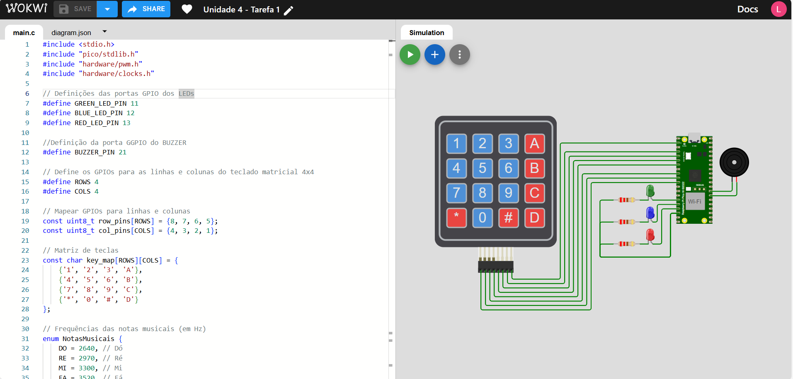

# EmbarcaTech_Unidade4_Tarefa1.

  

## Atividade 1 (Obrigatória): Controle de pinos GPIO com o emprego de um teclado matricial.

## Descrição do Projeto

Este projeto visa controlar pinos GPIO do microcontrolador RP2040, presente na placa de desenvolvimento Raspberry Pi Pico W, utilizando um teclado matricial 4x4. Através do simulador de eletrônica Wokwi, simulamos o acionamento de três LEDs RGB e o controle do sinal sonoro de um buzzer, baseados nas entradas do teclado matricial. 

## Componentes Utilizados

- **Teclado Matricial 4x4**: Utilizado para fornecer entradas ao microcontrolador.
- **03 LEDs RGB**: Utilizados para a sinalização visual de diferentes estados.
- **Buzzer**: Utilizado para emitir sinais sonoros.
- **Microcontrolador Raspberry Pi Pico W (RP2040)**: Responsável pelo controle dos pinos GPIO.

## Ambiente de Desenvolvimento

- **VS Code**: Ambiente de desenvolvimento utilizado para escrever e debugar o código.
- **Linguagem C**: Linguagem de programação utilizada no desenvolvimento do projeto.
- **Pico SDK**: Kit de Desenvolvimento de Software utilizado para programar a placa Raspberry Pi Pico W.
- **Simulador Wokwi**: Ferramenta de simulação utilizada para testar o projeto.

## Guia de Instalação

1. Clone o repositório:
2. Importe o projeto utilizando a extensão da Raspberry Pi:
3. Compile o código utilizando a extensão da Raspberry Pi:
4. Execute a simulação no Wokwi para testar o projeto.

## Guia de Uso

Para cada botão do teclado matricial, existe uma funcionalidade. Abaixo estão listadas cada uma delas:

| Botão | Função                                   |
|-------|------------------------------------------|
| A     | Acende LED verde                         |
| B     | Acende LED azul                          |
| C     | Acende LED vermelho                      |
| D     | Acende todos os LEDs                     |
| #     | Aciona o Buzzer                          |
| 0     | Apaga todos os LEDs                      |
| 1     | Toca a música Do-Re-Mi-Fa                |
| 2     | Toca a música Parabéns para você         |
| 3     | Toca a música Cai Cai Balão              |
| 4     | Toca a música Twinkle Twinkle Little Star|
| 5     | Toca a música Jingle Bells               |
| 6     | Toca a música Noite Feliz                |
| 7     | Toca a música Borboletinha               |
| 8     | Toca a música Pirulito que Bate Bate     |
| 9     | Toca a Sinfonia n.º 9 (Beethoven)        |
| *     | Toca a música tema do Super Mario        |

## Testes

Testes básicos foram implementados para garantir que cada componente está funcionando corretamente. 

## Colaboradores

- **Líder do Projeto**: [Lucas Gabriel Ferreira](https://github.com/usuario-lider)
- **Desenvolvedores**:
    - [Ângelo Miguel](https://github.com/micheltechEr)
    - [Maria Luiza Brasil Medrado](https://github.com/MariaLuizaBM)
    - [Matheus Capuchinho](https://github.com/Mathz0)
    - [Mateus Soares](https://github.com/mateussoaress)

## Link do Simulador Wokwi
Clique na imagem

  

## Vídeo da Solução

Assista ao vídeo ensaio que demonstra a solução trabalhada e os resultados obtidos nos experimentos:

  

